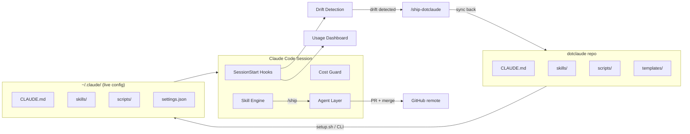

# dotclaude

**Version: 0.32.0**


Portable, version-controlled [Claude Code](https://docs.anthropic.com/en/docs/claude-code) configuration — carry your instructions, skills, hooks, and scripts across every machine and project.

---

## 📋 Table of Contents

- [Overview](#-overview)
- [Features](#-features)
- [Quick Start](#-quick-start)
- [Usage Guide](#-usage-guide)
- [What's Inside](#-whats-inside)
- [Sync Workflow](#-sync-workflow)
- [File Classification](#-file-classification)
- [Architecture](#-architecture)
- [Contributing](#-contributing)
- [License](#-license)

## 💡 Overview

Claude Code stores its configuration in `~/.claude/` — but that directory is local, unversioned, and lost when you switch machines. **dotclaude** solves this by turning your global Claude Code config into a Git repository with setup automation, drift detection, and a one-command sync workflow.

Clone once, run setup, and every Claude Code session starts with the same instructions, skills, and hooks — whether you're on your desktop, laptop, or a fresh CI runner.

## ✨ Features

- 🧠 **Global instructions** — `CLAUDE.md` with rules for autonomy, git hygiene, sprint workflows, token awareness, versioning, and response style
- ⚡ **12 custom skills** — ship, ship-dotclaude, commit, debug, deep-research, explain, readme, test, refresh-usage, project-setup, and more
- 📊 **Token management** — SessionStart dashboard with live rate limit tracking, cost guard hooks, and usage scraping
- 🔄 **Drift detection** — automatically detects when config files change during project sessions and prompts to sync
- 🖥️ **Cross-platform** — setup scripts for Unix (Bash) and Windows (PowerShell), path-portable hooks
- 📐 **Mermaid diagrams** — built-in rendering pipeline with dark theme and styled templates
- 🧩 **Inheritance model** — global rules as baseline, project-level `CLAUDE.md` files only extend or override
- 📦 **CLI installer** — `dotclaude setup` via the bundled CLI

## 🚀 Quick Start

### Fresh setup

```bash
git clone https://github.com/Jerry0022/dotclaude.git
cd dotclaude

# Unix / Git Bash
bash setup.sh

# Windows PowerShell
powershell -ExecutionPolicy Bypass -File setup.ps1

# Or via the CLI
node bin/cli.js setup
```

The setup script asks which **Claude plan** you have and configures accordingly:

| Plan | Instructions | Skills | Hooks | Optimized for |
|---|---|---|---|---|
| **Free** | CLAUDE-lite.md | 2 (commit, debug) | None | Maximum token budget |
| **Pro** | CLAUDE.md (full) | 5 | Dashboard | Balanced |
| **Max** | CLAUDE.md (full) | 7 (all) | All (dashboard, drift, cost guard) | Full power |

Then it:
1. Copies the plan-appropriate files to `~/.claude/`
2. Deploys the matching `settings.json` template (backs up existing)
3. Installs Node dependencies for hook scripts
4. Stores the repo path and selected plan for sync-check

### After setup

1. **Add MCP server permissions** to `~/.claude/settings.json` for your connected services (Google Calendar, Gmail, etc.) — see `templates/plugins-manifest.json` for permission patterns
2. **Install plugins** if not already present (see `plugins-manifest.json`)
3. **Start a Claude Code session** — the startup hook shows the usage dashboard automatically

## 📖 Usage Guide

> **New here?** This section explains what you now have after running setup and how to get the most out of it.

### What changed on your machine

Setup deployed a full Claude Code configuration to `~/.claude/`. Every Claude Code session — in any project, in any directory — now automatically loads:

- **Global instructions** (`CLAUDE.md`) that define how Claude behaves: commit style, response language, versioning rules, token budgets, and more
- **Hooks** that run on every session start: a usage dashboard showing your rate limits and a drift detector that tells you when config is out of sync
- **Skills** you can invoke via slash commands (see below)

### Available skills

These slash commands work in every Claude Code session:

| Command | What it does |
|---|---|
| `/ship` | Full shipping pipeline — rebase, quality gates, version bump, PR, merge, cleanup |
| `/ship-dotclaude` | Sync your local config changes back to this repo (see [Sync Workflow](#-sync-workflow)) |
| `/commit` | Create a conventional commit with proper formatting |
| `/debug` | Diagnose runtime errors and crashes — root-cause analysis first |
| `/deep-research` | Spawn an isolated research agent for thorough investigation |
| `/explain` | Explain code, architecture, or concepts with analogies |
| `/readme` | Generate a polished, modern README with badges, diagrams, and screenshots |
| `/test` | Visual preview of changes — screenshots, simulated output, rendered examples |
| `/refresh-usage` | Scrape live rate limit data from claude.ai |
| `/project-setup` | Audit repo hygiene — .gitignore, LICENSE, .editorconfig, AI config tracking |
| `/youtube-transcript` | Fetch and summarize a YouTube video transcript |

### Project-specific customization

The global `CLAUDE.md` is your **baseline** — it applies everywhere. When you start working in a specific project, you can create a project-level `CLAUDE.md` that **extends** the global rules without duplicating them.

**How it works:**

1. Create a `.claude/CLAUDE.md` (or `CLAUDE.md` at project root) in your project
2. Add only project-specific rules — tech stack, architecture, custom commands, module map
3. Start with this header:
   ```markdown
   <!-- Inherits from ~/.claude/CLAUDE.md — do not duplicate global rules here -->
   ```
4. To **change** a global rule for this project, use override syntax:
   ```markdown
   **Override (global §Commit Style):** Use Angular commit format instead of Conventional Commits.
   ```
5. To **add to** a global rule, use extension syntax:
   ```markdown
   **Extends (global §Sprint Regression Testing):** Also run `npm run test:e2e` after unit tests.
   ```

Project-level skills work the same way — they reference the global skill and describe only what's different.

### What you still need to do manually

| Task | Why |
|---|---|
| **Add MCP server permissions** | MCP servers have machine-specific UUIDs — add them to `~/.claude/settings.json` after connecting each service (Google Calendar, Gmail, Figma, etc.). See `templates/plugins-manifest.json` for the format. |
| **Install plugins** | Review `templates/plugins-manifest.json` and install the ones you need via Claude Code's plugin system. |
| **Connect external services** | MCP connections (Google, Figma, Postman, etc.) must be authorized per machine. |
| **Customize global rules** | Edit `~/.claude/CLAUDE.md` if you want to change the language, response style, or workflow rules. Changes are detected and can be synced back with `/ship-dotclaude`. |

### Session startup

Every time you start a Claude Code session, two things happen automatically:

1. **Usage Dashboard** — shows your current token consumption (5-hour window + weekly), expensive files to avoid, and recent sessions
2. **Drift Detection** — compares your live `~/.claude/` files against this repo and alerts you if anything is out of sync

If drift is detected, Claude will suggest running `/ship-dotclaude` to push your changes back to the repo — keeping all your machines in sync.

## 📦 What's Inside

| Category | Path | Purpose |
|---|---|---|
| **Instructions** | `CLAUDE.md` | Global rules: autonomy, git hygiene, sprint workflow, token awareness, versioning, response style, inheritance model |
| **Skills** | `skills/*/SKILL.md` | ship, ship-dotclaude, commit, debug, deep-research, explain, readme, test, refresh-usage, project-setup, youtube-transcript, readme-workspace |
| **Commands** | `commands/*.md` | refresh-usage (scrape live rate limits from claude.ai) |
| **Scripts** | `scripts/*.js` | startup-summary, precheck-cost, render-diagram, diagram-server, scrape-usage |
| **Templates** | `templates/` | settings.template.json, config.template.json, plugins-manifest.json |
| **Plugins** | `plugins/blocklist.json` | Blocked plugin list |
| **CLI** | `bin/cli.js` | Setup automation entry point |

## 🔄 Sync Workflow

When global config files are modified during any project session, the **SessionStart hook** detects drift and suggests running `/ship-dotclaude`.

The `/ship-dotclaude` skill:

1. Compares `~/.claude/` files against this repo
2. Copies changed files back
3. Bumps the version
4. Commits and pushes

This keeps the repo in sync without manual file copying.

## 📂 File Classification

### Tracked (portable, version-controlled)

- `CLAUDE.md`, skills, commands, scripts (`.js`), plugin blocklist
- Templates for machine-specific files

### Ignored (machine-specific, generated at runtime)

- `scripts/config.json` — regenerated on each startup with expensive-files list
- `scripts/session-history.json`, `scripts/usage-live.json`
- `plugins/cache/`, `plugins/data/`, `plugins/installed_plugins.json`
- `projects/`, `session-env/`, `plans/`, `backups/`, `telemetry/`
- `node_modules/`

### Templated (require per-machine adaptation)

- `settings.json` — hooks use `$HOME` for portability; MCP server UUIDs are machine-specific
- `config.json` — default limits are templated; `expensiveFiles` is populated at runtime

## 🏗️ Architecture

### System overview



### Inheritance model

Global `CLAUDE.md` is the baseline for every project. Project-level files extend or override it — never duplicate.

```
~/.claude/CLAUDE.md          ← global baseline (always loaded)
  └── project/CLAUDE.md      ← delta only (Extends / Override syntax)
        └── project skills   ← extend global skills, not redefine
```

Skills follow the same pattern: a project `/ship` skill says "use `npm run build:prod` in step 3" — it does not restate the entire flow.

### Hook system

Hooks run automatically at defined lifecycle events:

| Hook | Trigger | Purpose |
|---|---|---|
| `startup-summary.js` | SessionStart | Usage dashboard (5h + weekly rate limits) |
| `sweep-branches.js` | SessionStart | Clean orphaned worktrees and gone branches |
| `sync-dotclaude.js` | SessionStart | Drift detection — global config vs. repo |
| `precheck-cost.js` | PreToolUse | Token cost guard — blocks expensive reads (>20k tokens) |

### Skill system

Skills are slash-command workflows stored as `skills/<name>/SKILL.md`. Global skills live in `~/.claude/skills/`, project skills in `.claude/skills/`.

**Core skills:**

| Skill | Type | Description |
|---|---|---|
| `/ship` | Agent-delegated | Full shipping pipeline — 12 steps from rebase to merge |
| `/ship-dotclaude` | Agent-delegated | Sync global config changes back to the dotclaude repo |
| `/commit` | Inline | Conventional commit with formatting and co-author |
| `/debug` | Inline | Root-cause analysis for runtime errors |
| `/deep-research` | Agent-delegated | Isolated research agent for thorough investigation |
| `/explain` | Inline | Code/architecture explanation with analogies |
| `/readme` | Inline | Generate polished README with badges and diagrams |
| `/refresh-usage` | Inline | Scrape live rate limits from claude.ai |
| `/test` | Inline | Visual preview of changes (screenshots, simulated output) |
| `/project-setup` | Inline | Audit repo hygiene (.gitignore, LICENSE, .editorconfig) |

### Ship pipeline (`/ship`)

The ship flow is the centerpiece — a 12-step pipeline that takes committed work from a feature branch all the way to a merged PR on `main`.

**Agent delegation:** The main context collects metadata (branch, issues, version bump) and spawns a **subagent** that executes all steps independently. This prevents context window compression mid-flow.

```mermaid
flowchart LR
    A[Consolidate branches] --> B[Sync main]
    B --> C[Rebase]
    C --> D[Quality gates]
    D --> E[Version bump]
    E --> F[Commit & push]
    F --> G[Create PR]
    G --> H[Merge PR]
    H --> I[Git tag & release]
    I --> J[Update local main]
    J --> K[Build log]
    K --> L[Cleanup]
```



Key behaviors:
- **Test deduplication** — skips tests if the tree hash matches a previous successful run
- **Auto version bump** — evaluates change type (patch/minor/major) per semver rules
- **Zero leftover policy** — deletes all feature branches and worktrees after merge
- **Completion card** — every task ends with a standardized signal showing build ID, status, and usage delta

### Completion cards

Every finished task produces a completion card — a consistent, recognizable signal:

```
---
## ✨ a3f9b21 · Filter UI implemented

Shipped auf remote `feat/42-video-filters` via Pull-Request-Merge (PR #15)
\
Filter model and service added
UI component with apply button

src/filter.service.ts — new service
src/filter.component.ts — new component

📊 5h: 23% (+4%) | Weekly: 11% (+2%) | Sonnet: 8% (+1%)
---
```

The build ID (`a3f9b21`) is a content hash of the working tree (`git write-tree | cut -c1-7`) — deterministic, independent of commits, and identifies exactly which code state is running.

### Token management

A layered system prevents runaway token consumption:

1. **Cost guard hook** (`precheck-cost.js`) — intercepts tool calls before execution, blocks reads of files >20k tokens unless explicitly approved
2. **Strategic budget awareness** — CLAUDE.md rules surface cost trade-offs when approaching rate limits (>70% of 5h window or >60% of weekly)
3. **Usage tracking** (`/refresh-usage`) — scrapes live data from claude.ai, displayed in every completion card as delta metrics

### Diagram rendering

Mermaid diagrams render via a local pipeline (not the Mermaid MCP tool):

1. `render-diagram.js` converts Mermaid code to styled HTML using `template.html` (dark theme, Patrick Hand font)
2. `diagram-server.js` serves the HTML on port 9753
3. The Claude Code Preview panel auto-reloads on changes

## 🤝 Contributing

1. Fork this repo
2. Create a feature branch (`git checkout -b feat/my-change`)
3. Follow the commit convention: `type(scope): subject`
4. Open a PR — link related issues with `Closes #NNN`

## 📄 License

[MIT](LICENSE)
